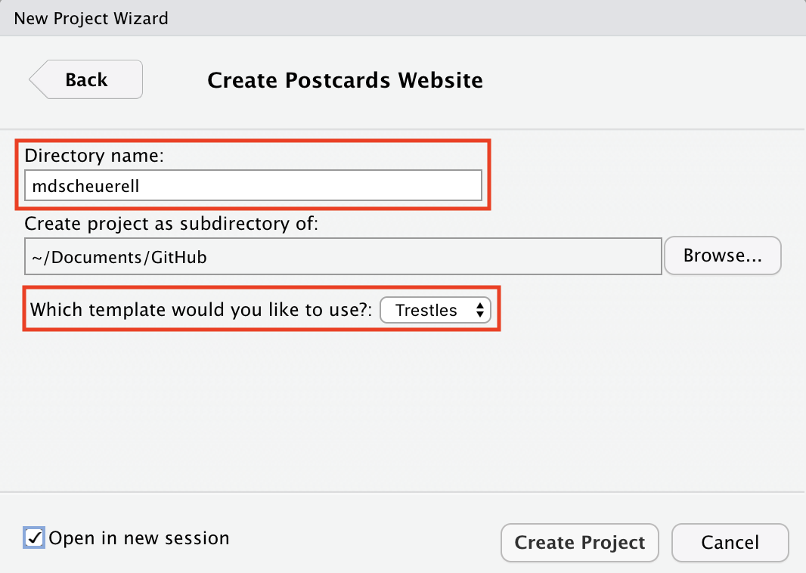
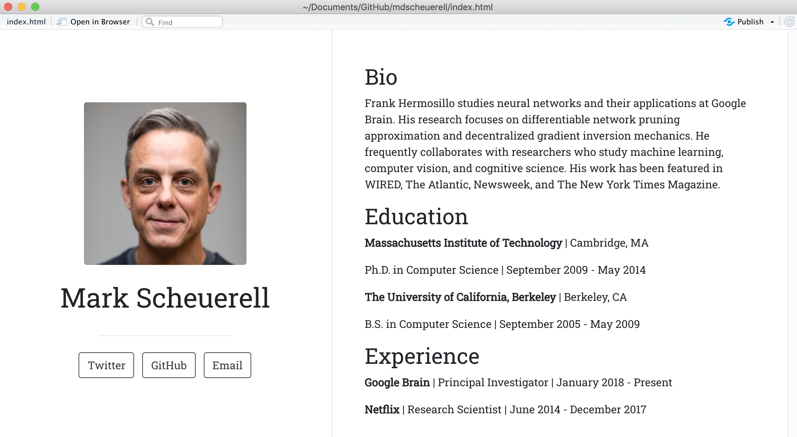
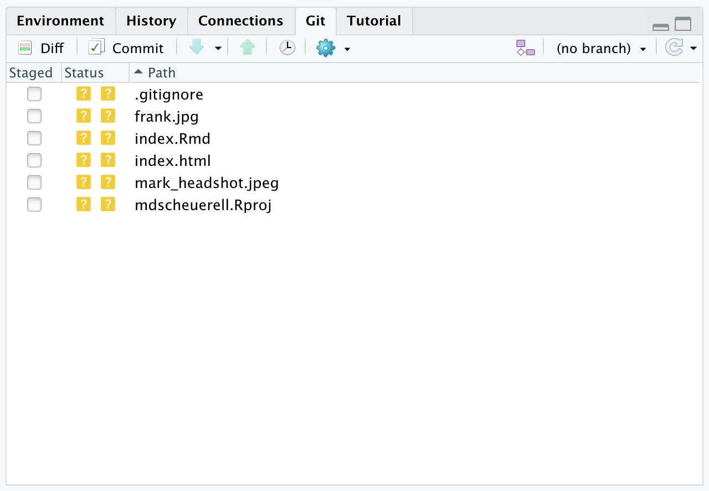
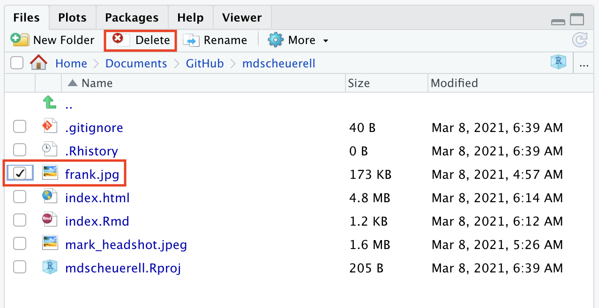
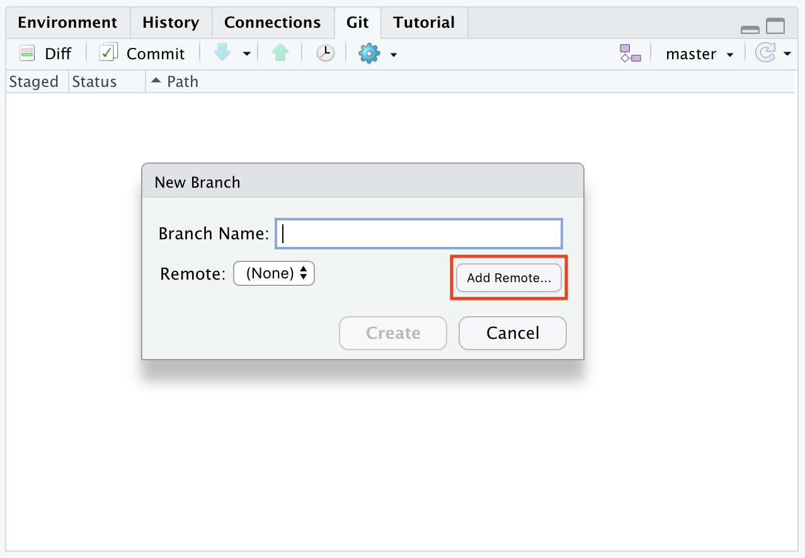
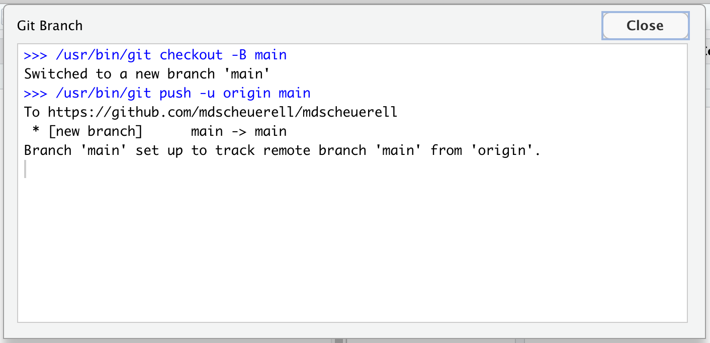
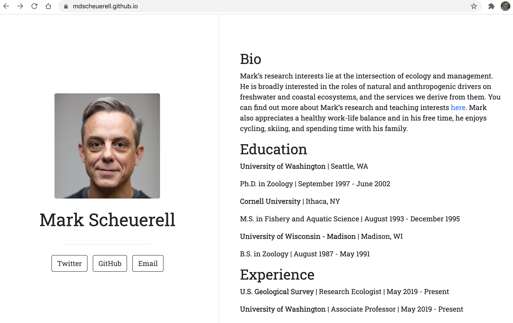

```{r set_defaults, include=FALSE}
knitr::opts_chunk$set(echo = TRUE)
```

***

# Background

One of the great features of **R Markdown** is using it to create static websites. These websites can be quite simple with only a single page or more complex with multiple pages and options, such as the website for this course. Websites created with **R Markdown** can be viewed/hosted directly on **GitHub** or [**Netlify**](https://www.netlify.com/), or copied over to a server such as http://students.washington.edu.

***

# Setup

For this exercise, we'll create a simple personal website and host it on **GitHub**. Although you can disply a static website from any **GitHub** repo, we'll use special repo based upon the same name as your **GitHub** username.

## Create a repo

<div class="boxy boxy-blue boxy-clipboard-list">
**Task:** Create a new repo on GitHub called `USERNAME.github.io` where `USERNAME` is your actual GitHub username.
</div>

<div class="boxy boxy-blue boxy-clipboard-list">
**Task:** In the **Description** box, type (or copy/paste) "This is the development repo for my personal website".
</div>

<div class="boxy boxy-blue boxy-clipboard-list">
**Task:** Make the repo **Public**.
</div>

<div class="boxy boxy-red boxy-exclamation">
**Note:** Despite GitHub's urging, **DO NOT** add a README, .gitignore or license file.
</div>

<div class="boxy boxy-blue boxy-clipboard-list">
**Task:** Click the green **Create repository** button when you're finished.
</div>


## Create RStudio project

The next step is to create a new project in **RStudio**.

<div class="boxy boxy-red boxy-exclamation">
**Note:** Rather than base this new project on an existing repo, as we've done in the past, we'll instead choose **New Directory**.
</div>

```{r rs_new_proj, echo = FALSE, out.width = "70%", fig.align = "center"}
knitr::include_graphics("img/rs_new_project.png")
```

<br>

<div class="boxy boxy-blue boxy-clipboard-list">
**Task:** Scroll down the options for **Project Type** and select `Postcards Website`.
</div>

```{r rs_postcards, echo = FALSE, out.width = "70%", fig.align = "center"}
knitr::include_graphics("img/rs_postcards.png")
```

<br>

<div class="boxy boxy-blue boxy-clipboard-list">
**Task:** In the next **Create Postcards Website** window, enter your own **GitHub** username in the field for **Directory name**.
</div>

<div class="boxy boxy-blue boxy-clipboard-list">
**Task:** Choose the location where you'd like this new project to live.
</div>

<div class="boxy boxy-blue boxy-clipboard-list">
**Task:** Select the `Trestles` template from the drop-down menu.
</div>

<div class="boxy boxy-blue boxy-clipboard-list">
**Task:** When you are finished, check the box next to **Open in new session** and click the **Create Project** button.
</div>


```{r rs_postcards_details, echo = FALSE, out.width = "70%", fig.align = "center"}

```

<br>

# Postcards website

You now have a very simple **RStudio** project with 2 (or possibly 3) files:

1) `index.Rmd`

2) `frank.jpg`

3) [optional] `YOUR_USERNAME.Rproj` (where `YOUR_USERNAME` is your **GitHub** username)

## Content

The `index.Rmd` file contains the information to be displayed on your website. When first created, it should look like this:

```{r postcards_index_blank, echo = FALSE, out.width = "90%", fig.align = "center"}
knitr::include_graphics("img/postcards_index_blank.png")
```

<br>

The top section is a standard YAML that contains 4 fields:

1) `title`

2) `image`

3) `links`

4) `output`

### Title

The `title` field in `index.Rmd` is the title of your website that will be displayed at the top.

<div class="boxy boxy-blue boxy-clipboard-list">
**Task:** Change the title from `Frank Mermosillo` to something relative to you (eg, your first and last names would be good options).
</div>

### Image

The `image` field in `index.Rmd` shows the name of the picture that will be displayed on your website. At present, it's set to `frank.jpg`, so you should change this to be the name of a picture/photo you'd rather have displayed. 

<div class="boxy boxy-orange boxy-lightbulb">
**Tip:** A headshot is always a great choice, but you could use an avatar or any other image you'd like.
</div>

<div class="boxy boxy-red boxy-exclamation">
**Note:** Whatever image file you choose, you'll need to move or copy it to the folder/directory where this project lives.
</div>

### Links

The next block that begins with `links` contains a list of `label/url` pairs. These will be buttons on your website that someone could click to direct them to other information about you elsewhere. The last `label/url` pair is for your email address.

<div class="boxy boxy-orange boxy-lightbulb">
**Tip:** Not all of these `label/url` pairs are necessary, so you can delete any of them if you'd like. You can also add more of them if you'd like evern more options for others.
</div>

<div class="boxy boxy-blue boxy-clipboard-list">
**Task:** Go ahead and edit/delete/add any options you'd like here.
</div>

When you are finished, your YAML section should resemble something like this:

```{r postcards_yaml, echo = FALSE, out.width = "90%", fig.align = "center"}
knitr::include_graphics("img/postcards_yaml.png")
```

<br>

*** 

# Build the site

Let's go ahead and preview our website, which simply requires you to press the **Knit** button in the editor pane. When you do, **RStudio** will open a preview of your website in a new viewer window that should look something like this:

```{r postcards_preview, echo = FALSE, out.width = "100%", fig.align = "center"}

```

<br>

<div class="boxy boxy-orange boxy-lightbulb">
**Tip:** From here on, anytime you make a change to the content in `index.Rmd` you can just click the **Knit** button to instantly generate a preview.
</div>


***

# Personal details

Now it's time to edit `index.Rmd` so it contains information about you instead of Frank. At present there are headings and content for these sections:

* **Bio**

* **Education**

* **Experience**

You can edit any of these heading names and corresponding content to meet your personal preferences. 

<div class="boxy boxy-orange boxy-lightbulb">
**Tip:** Because this information is all written with standard **Markdown**, you can take advantage of any of the additional formatting options.
</div>

For example, the university and company names in the example template are enclosed with double-asterisks (`**`) so that they render in **bold** type. You could add an (un)ordered list, different heading levels, links to other URLs, equations, or additional images.

Here is an example of what your website could look like after you've edited the sections and content.

```{r postcards_final, echo = FALSE, out.width = "100%", fig.align = "center"}
knitr::include_graphics("img/postcards_final.png")
```

<br>

***

# Set up version control

Once you have a complete draft of your website, it would be a good time to commit our local changes. Before we can do so, though, we need to place this project under version control with **Git**. There are 3 different ways to do this, each of which is equally effective.

<div class="boxy boxy-blue boxy-clipboard-list">
**Option 1:** In the terminal/shell window, navigate via `cd` to the project's directory and type `git init`.
</div>

<div class="boxy boxy-blue boxy-clipboard-list">
**Option 2:** At the R command prompt in **RStudio**, type `usethis::use_git()`.
</div>

<div class="boxy boxy-blue boxy-clipboard-list">
&nbsp; **Option 3:** From the main menu in **RStudio**, do the following:
<ul>
  <li>Select **Tools > Project Options...**</li>
  <li>Click on **Git/SVN** in the left column</li>
  <li>From the **Version control system:** dropdown menu, select `Git`</li>
  <li>Click **OK** when you are finished</li>
  <li>You will be asked if you want to create a git repository; select **Yes**</li>
  <li>You will be asked if you want to restart **RStudio**; select **Yes**</li>
</ul>
</div>

```{r rs_proj_options, echo = FALSE, out.width = "70%", fig.align = "center"}
knitr::include_graphics("img/rs_proj_options.png")
```

<br>

<div class="boxy boxy-red boxy-exclamation">
**Note:** You should now see a **Git** pane in **RStudio** with several untracked files waiting to be added and committed.
</div>

```{r rs_git_pane, echo = FALSE, out.width = "70%", fig.align = "center"}

```

<br>

Before we commit the files, let's go ahead and delete the picture of Frank that was included in the project when it was created.

<div class="boxy boxy-blue boxy-clipboard-list">
**Task:** In the **File** pane in **RStudio** check the box next to `frank.jpg` and then click the **Delete** button.
</div>

```{r rs_delete_frank, echo = FALSE, out.width = "70%", fig.align = "center"}

```

<br>

<div class="boxy boxy-blue boxy-clipboard-list">
**Task:** Go ahead and commit your local changes to all of the files in the **Git** pane.
</div>
 
<div class="boxy boxy-red boxy-exclamation">
**Note:** We haven't yet connected this repo to **GitHub**, so you can't actually push your changes to the cloud.
</div>

***

# Connecting to GitHub

Now that you have a draft of your website, it's time to connect this local **RStudio** project to the **GitHub** repo we created at the beginning of this exercise. To do so, follow these steps:

<div class="boxy boxy-blue boxy-clipboard-list">
**Task:** Click on the two purple boxes and a white square in the **Git** pane.
</div>

```{r rs_setup_gh_1, echo = FALSE, out.width = "70%", fig.align = "center"}
knitr::include_graphics("img/rs_setup_gh_1.png")
```

<br>

<div class="boxy boxy-blue boxy-clipboard-list">
**Task:** Click the **Add remote...** button.
</div>

```{r rs_setup_gh_2, echo = FALSE, out.width = "70%", fig.align = "center"}

```

<br>

<div class="boxy boxy-blue boxy-clipboard-list">
**Task:** In the field for **Remote Name** enter `origin` and in the field for **Remote URL** copy/paste the URL of your **GitHub** repo (this should be `https://github.com/USERNAME/USERNAME.github.io` where `USERNAME` is your actual **GitHub** username).
</div>

```{r rs_setup_gh_3, echo = FALSE, out.width = "70%", fig.align = "center"}
knitr::include_graphics("img/rs_setup_gh_3.png")
```

<br>

<div class="boxy boxy-blue boxy-clipboard-list">
**Task:** When you are finished, click **Add** and **RStudio** will respond with a window showing you that your local `main` branch is set up to track the remote branch on **GitHub**, and that files you committed above have been pushed to your **GitHub** repo.
</div>

<div class="boxy boxy-red boxy-exclamation">
**Note:** If clicking **Add** instead takes you back to the **New branch** window and the **Create** button is grayed out, enter `main` in `Branch name:` field and then click **Create**.
</div>

```{r rs_setup_gh_4, echo = FALSE, out.width = "70%", fig.align = "center"}

```

<br>

<div class="boxy boxy-blue boxy-clipboard-list">
**Task:** Verify that everything has indeed been pushed to **GitHub** by navigating to your repo there and refreshing the browser. You should now see several files listed there.
</div>

```{r gh_refresh, echo = FALSE, out.width = "90%", fig.align = "center"}
knitr::include_graphics("img/gh_refresh.png")
```

<br>

***

# Viewing on GitHub

To view your website on **GitHub**, simply navigate over to `USERNAME.github.io` where `USERNAME` is your actual GitHub username. You should see something like this.

```{r gh_finished_view, echo = FALSE, out.width = "100%", fig.align = "center"}

```

<br>

<div class="boxy boxy-success boxy-check">
**Success:** At this point you should be all set up to make changes to your website design in **RStudio** and push them to **GitHub** when you're finished.
</div>

***

# Website layouts

## Postcards

We chose the `Trestles` template for our website layout, but there are others available as well (see Sean Kross' [postcard templates](https://github.com/seankross/postcards#the-templates)).

<div class="boxy boxy-orange boxy-lightbulb">
**Tip:** To switch to a different theme, simply change the YAML `output` line.
</div>

```markdown
output:
  postcards::trestles
```

to be something like

```markdown
output:
  postcards::jolla_blue
```

## Other formats

You could always specify a completely different format/layout/template in the YAML of your `index.Rmd` file, knit it to `index.html`, and then that new site would render instead of the `{postcards}` site we just created.


