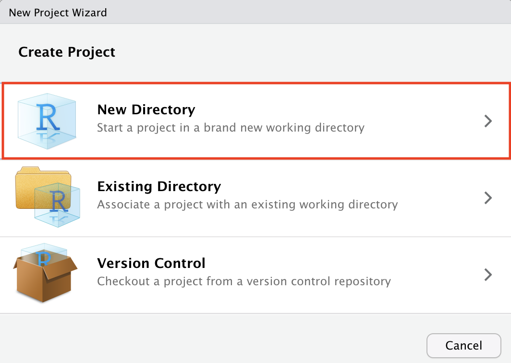
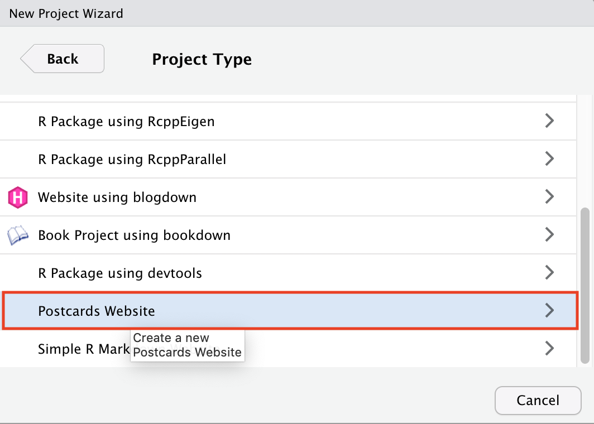
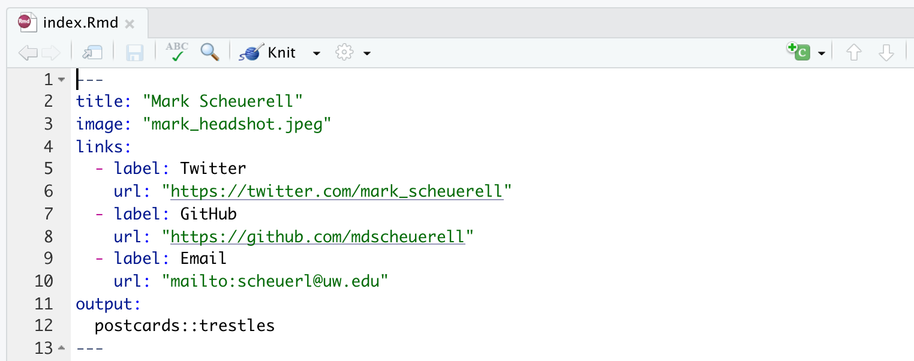
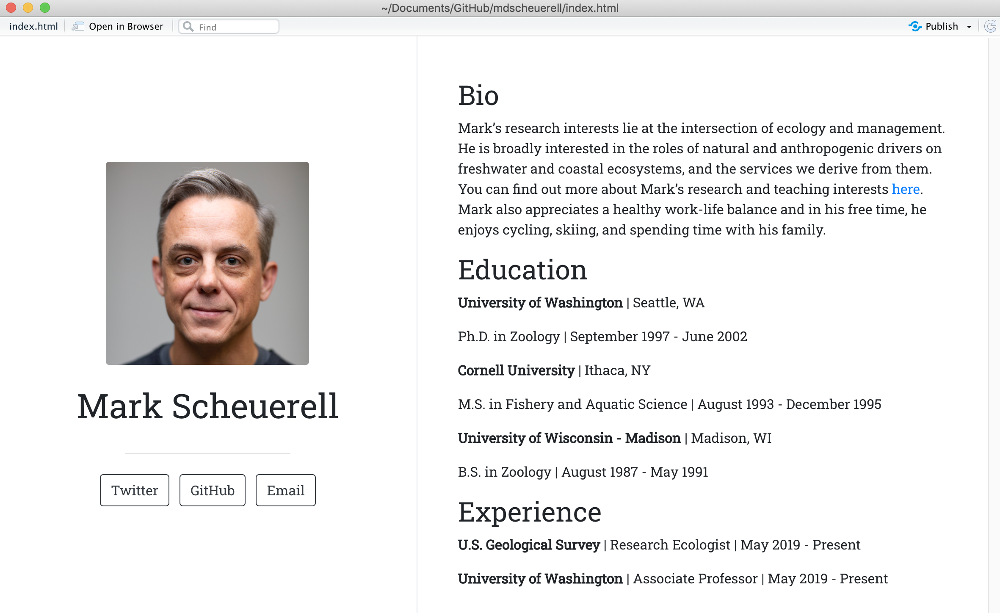
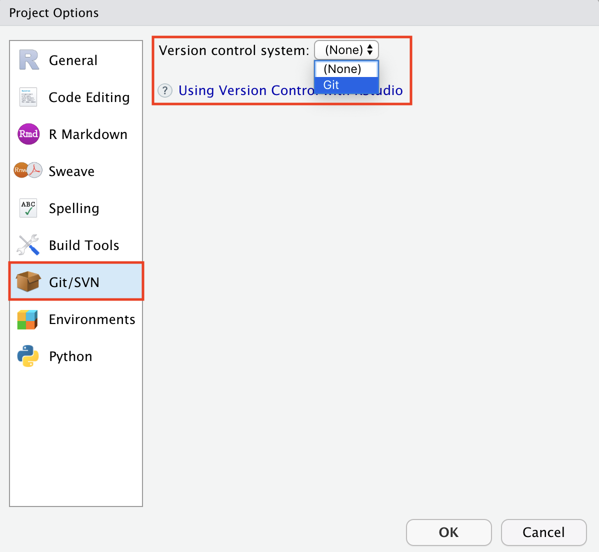
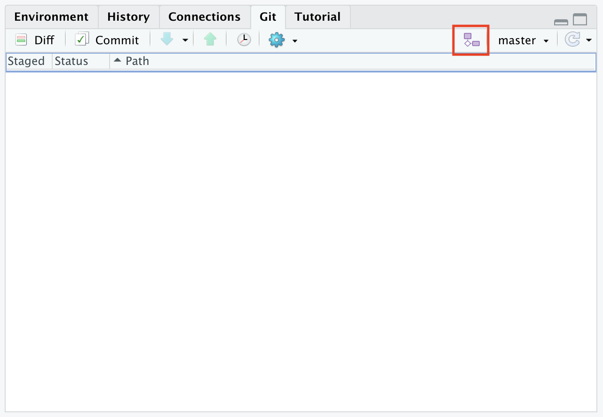
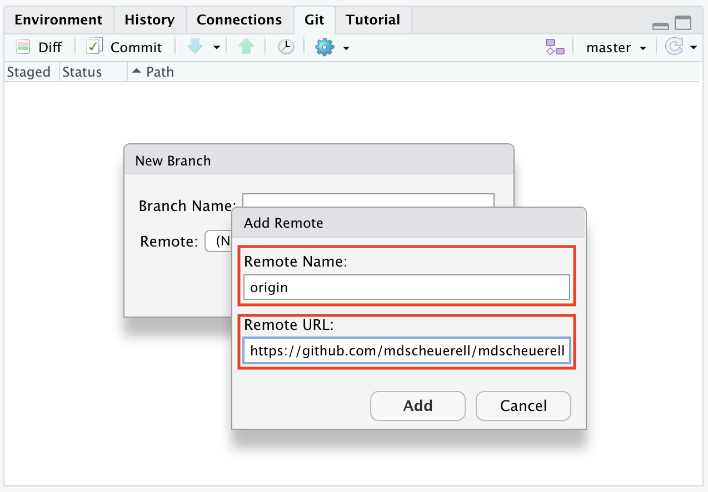
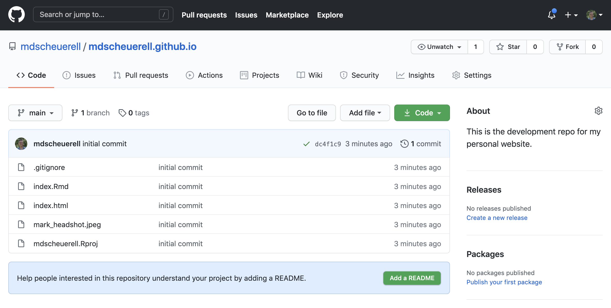

```{r set_defaults, include=FALSE}
knitr::opts_chunk$set(echo = TRUE)
```

***

# Background

One of the great features of **R Markdown** is using it to create static websites. These websites can be quite simple with only a single page or more complex with multiple pages and options, such as the website for this course. Websites created with **R Markdown** can be viewed/hosted directly on **GitHub** or [**Netlify**](https://www.netlify.com/), or copied over to a server such as http://students.washington.edu.

***

# Setup

For this exercise, we'll create a simple personal website and host it on **GitHub**. Although you can display a static website from any **GitHub** repo, we'll use special repo with the same name as your **GitHub** username.

## Create a repo

Create a new repo on GitHub called `USERNAME.github.io` where `USERNAME` is your actual GitHub username.

In the **Description** box, type (or copy/paste) "This is the development repo for my personal website".

Make the repo **Public**.

Despite GitHub's urging, **DO NOT** add a README, .gitignore or license file.

Click the green **Create repository** button when you're finished.

## Create RStudio project

The next step is to create a new project in **RStudio**. However, rather than base this new project on an existing repo, as we've done in the past, we'll instead choose **New Directory**.

```{r rs_new_proj, echo = FALSE, out.width = "70%", fig.align = "center"}

```

<br>

Scroll down the options for **Project Type** and select `Postcards Website`.

```{r rs_postcards, echo = FALSE, out.width = "70%", fig.align = "center"}

```

<br>

In the next **Create Postcards Website** window, enter your own **GitHub** username in the field for `Directory name:`

Choose the location where you'd like this new project to live.

Select the `Trestles` template from the drop-down menu.

When you are finished, check the box next to `Open in new session` and click the **Create Project** button.

```{r rs_postcards_details, echo = FALSE, out.width = "70%", fig.align = "center"}
knitr::include_graphics("img/rs_postcards_details.png")
```

<br>

# Postcards website

You now have a very simply **RStudio** project with 3 files:

1) `index.Rmd`

2) `frank.jpg`

3) `YOUR_USERNAME.Rproj` (where `YOUR_USERNAME` is your **GitHub** username)

## Content

The `index.Rmd` file contains the information to be displayed on your website. When first created, it should look like this:

```{r postcards_index_blank, echo = FALSE, out.width = "100%", fig.align = "center"}
knitr::include_graphics("img/postcards_index_blank.png")
```

<br>

The top section is a standard YAML that contains 4 fields:

1) `title`

2) `image`

3) `links`

4) `output`

### Title

The `title` field in `index.Rmd` is the title of your website that will be displayed at the top. Go ahead and change this from `Frank Mermosillo` to something relative to you. For example, your first and last names would be good options.

### Image

The `image` field in `index.Rmd` shows the name of the picture that will be displayed on your website. At present, it's set to `frank.jpg`, so you should change this to be the name of a picture/photo you'd rather have displayed. A headshot is always a great choice, but you could use an avatar or any other image you'd like.

**Note**: whatever name/file you choose, you'll need to move or copy that image file to the folder/directory where this project lives.

### Links

The next block that begins with `links` contains a list of `label/url` pairs. These will be buttons on your website that someone could click to direct them to other information about you elsewhere. The last `label/url` pair is for your email address. Not all of these `label/url` pairs are necessary, so you can delete any of them if you'd like. You can also add more of them if you'd like even more options for others. Go ahead and edit/delete/add any options you'd like here.

When you are finished, your YAML section should resemble something like this:

```{r postcards_yaml, echo = FALSE, out.width = "100%", fig.align = "center"}

```

<br>

*** 

# Build the site

Let's go ahead and preview our website, which simply requires you to press the `Knit` button in the editor pane. When you do, **RStudio** will open a preview of your website in a new viewer window that should look something like this:

```{r postcards_preview, echo = FALSE, out.width = "100%", fig.align = "center"}
knitr::include_graphics("img/postcards_preview.png")
```

<br>

From here on, anytime you make a change to the content in `index.Rmd` you can just click the `Knit` button to instantly generate a preview.

***

# Personal details

Now it's time to edit `index.Rmd` so it contains information about you instead of Frank. At present there are headings and content for these sections:

* **Bio**

* **Education**

* **Experience**

You can edit any of these heading names and corresponding content to meet your personal preferences. Because this information is all written with standard **Markdown**, you can take advantage of any of the additional formatting options.

For example, the university and company names in the example template are enclosed with double-asterisks (`**`) so that they render in **bold** type. You could add an (un)ordered list, different heading levels, links to other URLs, equations, or additional images.

Here is an example of what your website could look like after you've edited the sections and content.

```{r postcards_final, echo = FALSE, out.width = "100%", fig.align = "center"}

```

<br>

***

# Set up version control

Once you have a complete draft of your website, it would be a good time to commit our local changes. Before we can do so, though, we need to place this project under version control with **Git**. There are 3 different ways to do this, each of which is equally effective.

1) In the shell, navigate via `cd` to the project's directory and type `git init`.

2) At the command prompt in **RStudio**, type `usethis::use_git()`.

3) From the main menu in **RStudio**,

    - select `Tools > Project Options...`   
    - click on `Git/SVN` in the left column  
    - select `Git` from the `Version control system:` dropdown menu  
    - click **OK** when you are finished  
    - you will be asked if you want to create a git repository; select **Yes**  
    - you will be asked if you want to restart **RStudio**; select **Yes**  

```{r rs_proj_options, echo = FALSE, out.width = "70%", fig.align = "center"}

```

<br>

You should now see a **Git** pane in **RStudio** several untracked files waiting to be committed.

```{r rs_git_pane, echo = FALSE, out.width = "70%", fig.align = "center"}
knitr::include_graphics("img/rs_git_pane.png")
```

<br>

Before we commit the files, let's go ahead and delete the picture of Frank that was included in the project when it was created. In the **File** pane in **RStudio** check the box next to `frank.jpg` and then click the `Delete` button.

```{r rs_delete_frank, echo = FALSE, out.width = "70%", fig.align = "center"}
knitr::include_graphics("img/rs_delete_frank.png")
```

<br>

Now go ahead and commit your local changes to all of the files in the **Git** pane. Note, though, that we haven't yet connected this repo to **GitHub**, so you can't actually push your changes to the cloud.

***

# Connecting to GitHub

Now that you have a draft of your website, it's time to connect this local **RStudio** project to the **GitHub** repo we created at the beginning of this exercise. To do so, follow these steps:

* Click on the two purple boxes and a white square in the **Git** pane.

```{r rs_setup_gh_1, echo = FALSE, out.width = "70%", fig.align = "center"}

```

<br>

* Click `Add remote...`

```{r rs_setup_gh_2, echo = FALSE, out.width = "70%", fig.align = "center"}
knitr::include_graphics("img/rs_setup_gh_2.png")
```

<br>

* In the field for `Remote Name:` enter `origin` and in the field for `Remote URL:` copy/paste the URL of your **GitHub** repo (this should be `https://github.com/USERNAME/USERNAME.github.io` where `USERNAME` is your actual **GitHub** username).

```{r rs_setup_gh_3, echo = FALSE, out.width = "70%", fig.align = "center"}

```

<br>

When you are finished, click **Add** and **RStudio** will respond with a window showing you that your local `main` branch is set up to track the remote branch on **GitHub**, and that files you committed above have been pushed to your **GitHub** repo.

**Note**: If clicking **Add** instead takes you back to the ***RStudio** does not allow to click the **New branch** window and the **Create** button is grayed out, enter `main` in `Branch name:` field and then click **Create**.

```{r rs_setup_gh_4, echo = FALSE, out.width = "70%", fig.align = "center"}
knitr::include_graphics("img/rs_setup_gh_4.png")
```

<br>

Let's verify that everything has indeed been pushed to **GitHub** by navigating to your repo there and refreshing the browser. You should now see several files listed there.

```{r gh_refresh, echo = FALSE, out.width = "90%", fig.align = "center"}

```

<br>

***

# Viewing on GitHub

To view your website on **GitHub**, simply navigate over to `USERNAME.github.io` where `USERNAME` is your actual GitHub username. You should see something like this.

```{r gh_finished_view, echo = FALSE, out.width = "100%", fig.align = "center"}
knitr::include_graphics("img/gh_finished_view.png")
```

<br>

***

# Other layouts

## Postcards

At this point you should be all set up to make changes to your website design in **RStudio** and push them to **GitHub** when you're finished. For example, we chose the `Trestles` template for our layout, but there are others available (see Sean Kross' [postcard templates](https://github.com/seankross/postcards#the-templates)). To switch to a different theme, simply change the YAML line

```markdown
output:
  postcards::trestles
```

to be something like

```markdown
output:
  postcards::jolla_blue
```

## Other formats

You could also specify a completely different format/layout/template, save it as `index.html`, and then that new site would render instead of the `{postcards}` site we just created.


